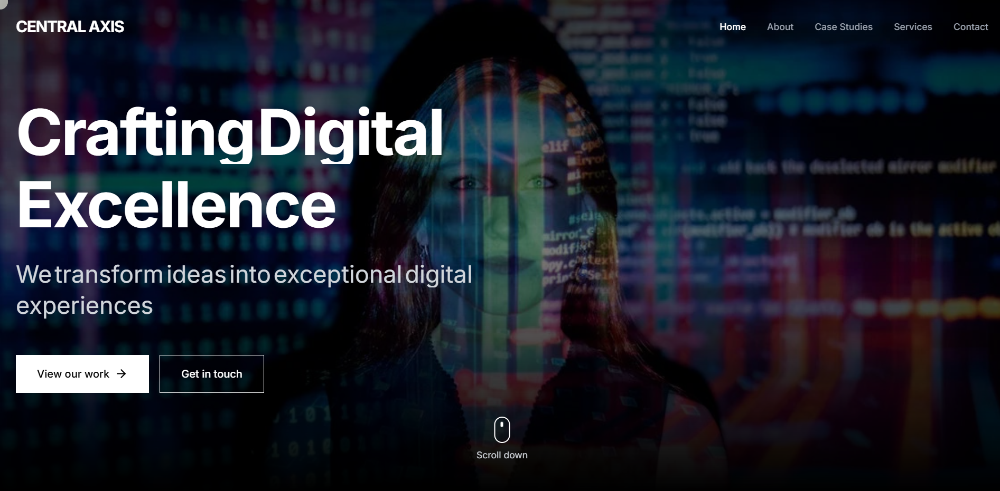
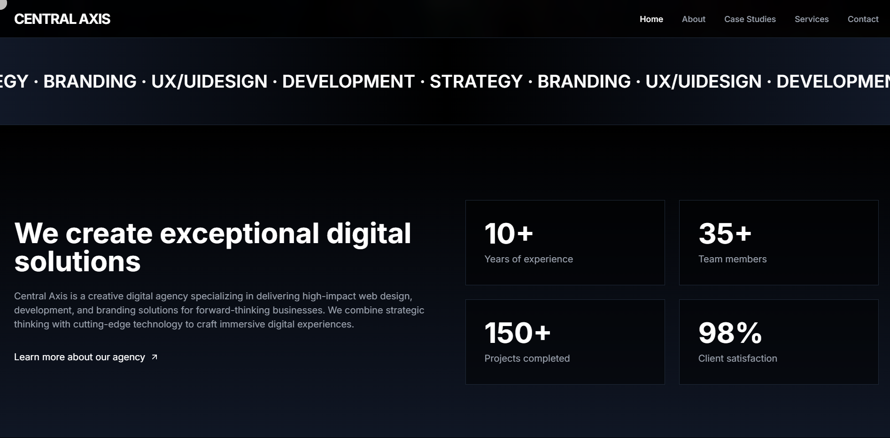
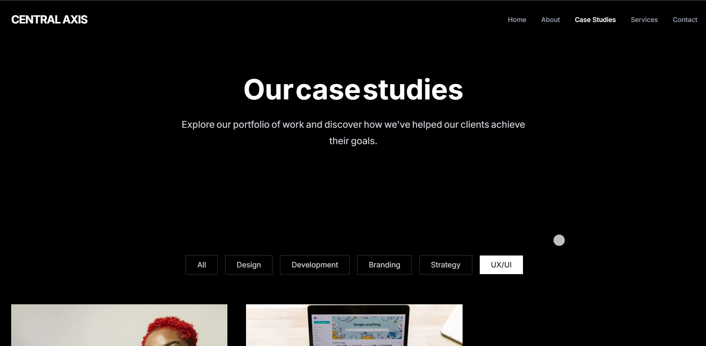
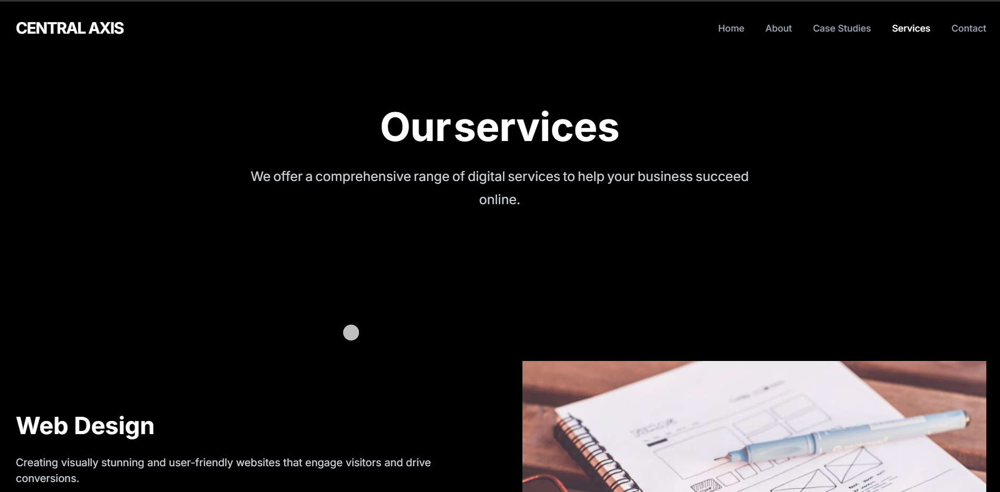

# 🧭 Central Axis

Welcome to **Central Axis**, a clean and responsive web interface built using **Vite + React + TailwindCSS**.  
It’s fast, minimal, and designed for modern user experience.

🌐 **Live Preview**  
👉 [Click Here to View](https://zp1v56uxy8rdx5ypatb0ockcb9tr6a-oci3--5173--4d9fd228.local-credentialless.webcontainer-api.io/)

---

## 🚀 Features

- ⚛️ Built with React + TypeScript
- 🎨 TailwindCSS for rapid UI styling
- ⚡ Powered by Vite for lightning-fast development
- 📱 Fully responsive design
- 🧼 Clean folder and component structure

---

## 📸 Screenshots!

